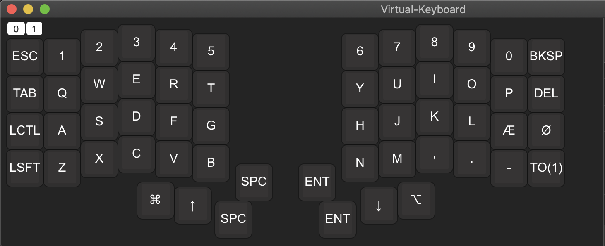

 

## Project

Work-in-progress of a onscreen keyboard viewing the key hit on the keyboard.
I'll be using it to learn the keebio iris layout.

## Status

Need to detect layer switching and do some house keeping.

## Based on

https://github.com/electron-react-boilerplate/electron-react-boilerplate
